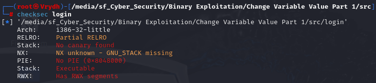

# Change Variable Value Part 1

Inspired by the [CryptoCat](https://github.com/Crypto-Cat/CTF/tree/main/pwn/binary_exploitation_101/01-overwriting_stack_variables_part1) repository.
This challenge demonstrates how to change a variable by exploiting a buffer overflow.

## Quick Overview

- **Goal**: Modify a specific variable via buffer overflow.
- **Vulnerability**: Overwriting stack variables.
- **Tools**: GDB, Ghidra, and Python.

## Information Gathering

1. Check binary file properties first using `checksec file_name` 
   

   - **Architecture** : 32-bit
   - **Canary** : No Canary
   - **PIE** : No PIE

2. Decompile binary file 
   

   - `char local_1a` only contain 6 characters
   - `int local_14` can be exploit from `gets()` function on line 15

## Steps to Solve

Once we know that we can bypass authentication via input from `gets()`, we just need to input characters beyond what the `local_1a` variable can store.

**Payload**: `aaaaaaa` or other characters more than 6

